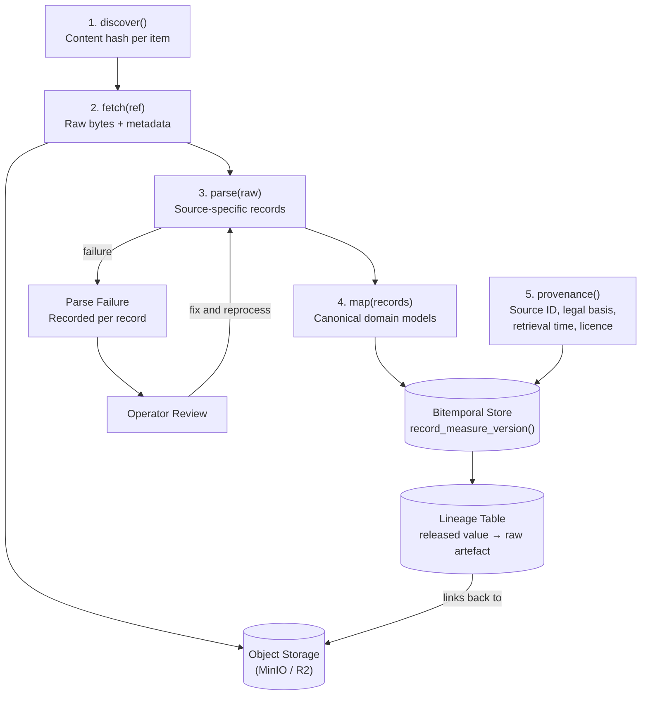
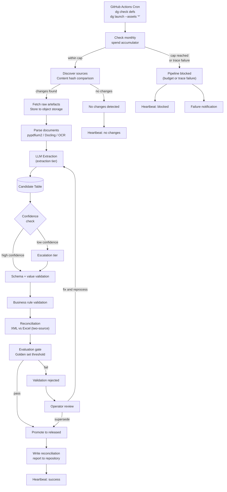
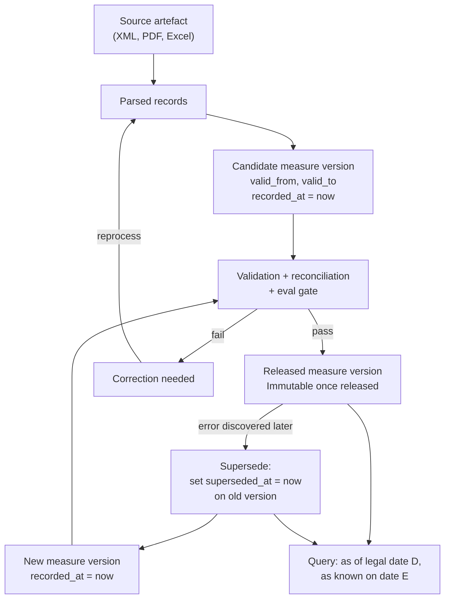
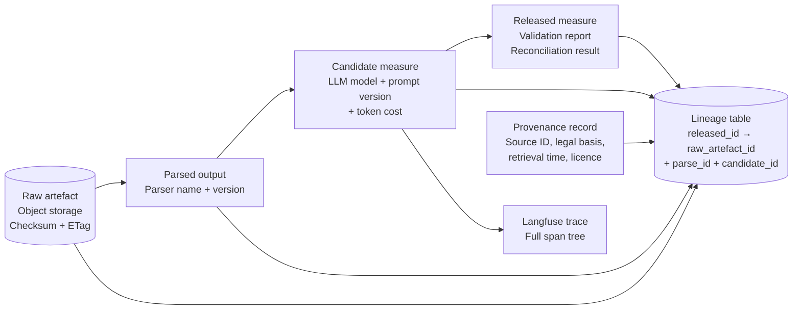
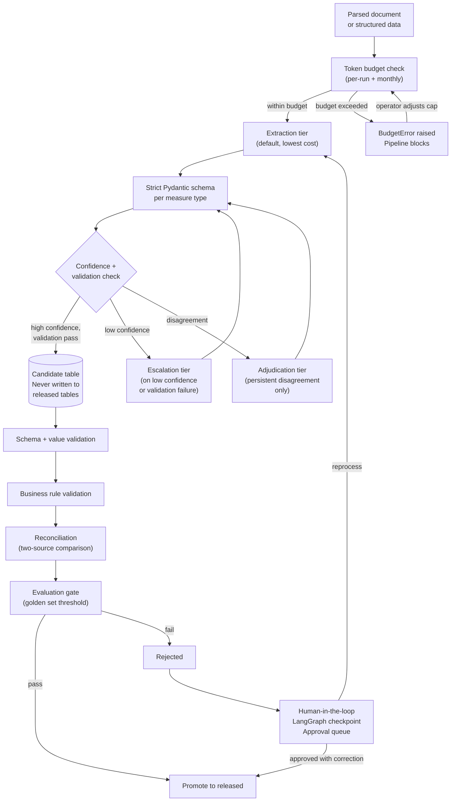
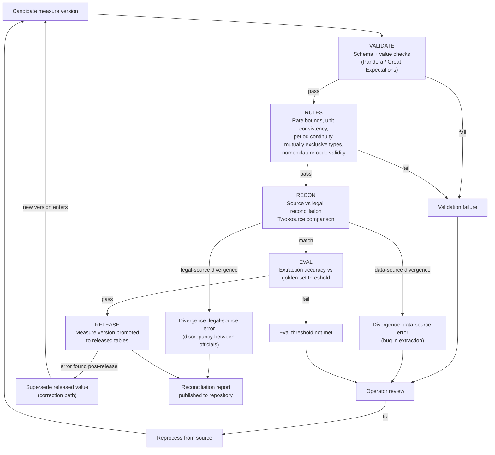
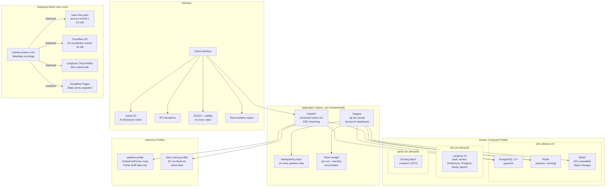

# System Flow v2

**Supersedes:** `system-flow-v1.md`
**Produced in:** Phase 0, Step 9
**Corrections applied:** All 8 defects from Appendix H of `eu-tariff-engine-build-plan-v6.md`

## Defect corrections summary

| # | Defect in v1 | Correction in v2 |
|---|-------------|------------------|
| 1 | Diagram 1: provenance is a terminal node | Provenance flows into the bitemporal store via `record_measure_version()` |
| 2 | Diagram 1: no lineage edge from released measures to raw artefact | Lineage table links released values back to raw artefacts in object storage |
| 3 | Diagram 2: daily run omits parsing, extraction, candidates, escalation | Daily run includes all stages; extraction runs as part of the daily job for new or changed documents |
| 4 | All diagrams: failure paths terminate with no recovery | Review, reprocess, and supersede loops added to every failure path |
| 5 | Diagram 5: model names hard coded | Relabelled as extraction tier, escalation tier, and adjudication tier |
| 6 | Vocabulary inconsistent across diagrams | Unified: VALIDATE, RULES, RECON, EVAL, RELEASE across all diagrams |
| 7 | Diagram 7: missing components | Redis, parse profile, pipeline/client_facing profiles, idempotency keys, token budget, reconciliation report, Article 50 disclosure added |
| 8 | Literal newlines in quoted labels | All multi-line labels use ` ` |

---

## Diagram 1: Source Adapter Flow

Shows the five-step adapter contract. Provenance flows into the store (defect 1 fix). Lineage links released values to raw artefacts (defect 2 fix). Parse failures enter a review loop (defect 4 fix).

---

## Diagram 2: Daily Pipeline Run

The scheduled job (GitHub Actions cron on weekday mornings) runs the full pipeline. Document parsing and extraction are included when new or changed documents are detected (defect 3 fix). Every terminal path writes a heartbeat (defect 4 fix).

---

## Diagram 3: Bitemporal Data Model

Shows how every value carries two time axes and how corrections work through supersession rather than mutation (defect 4 fix).

---

## Diagram 4: Lineage and Audit Trail

Shows the chain from raw artefact to released value. Every link is preserved and queryable (defect 2 fix).

---

## Diagram 5: LLM Extraction and Escalation

Uses tier names, never model names (defect 5 fix). Unified vocabulary (defect 6 fix). Failure paths have recovery loops (defect 4 fix).

---

## Diagram 6: Validation and Release Gate

Unified vocabulary across all validation steps (defect 6 fix). Recovery paths from every rejection (defect 4 fix).

---

## Diagram 7: Infrastructure and Deployment

Includes Redis, parse profile, named inference profiles, idempotency keys, token budget, reconciliation report, and Article 50 disclosure (defect 7 fix).

---

## Vocabulary reference

Consistent terms used across all diagrams (defect 6 fix):

| Term | Meaning |
|------|---------|
| VALIDATE | Schema and value validation (Pandera / Pydantic) |
| RULES | Business rule validation (rate bounds, period continuity, etc.) |
| RECON | Source vs legal reconciliation (two-source comparison) |
| EVAL | Evaluation gate (golden set accuracy threshold) |
| RELEASE | Promotion from candidate to released table |
| SUPERSEDE | Correction of a released value (append new version, mark old as superseded) |
| CANDIDATE | Measure version awaiting validation (never served to clients) |
| REVIEW | Operator review queue with a documented exit path |
| Extraction tier | Default LLM tier (lowest cost, configured in Settings) |
| Escalation tier | Used on low confidence or validation failure |
| Adjudication tier | Used only for persistent disagreement |
